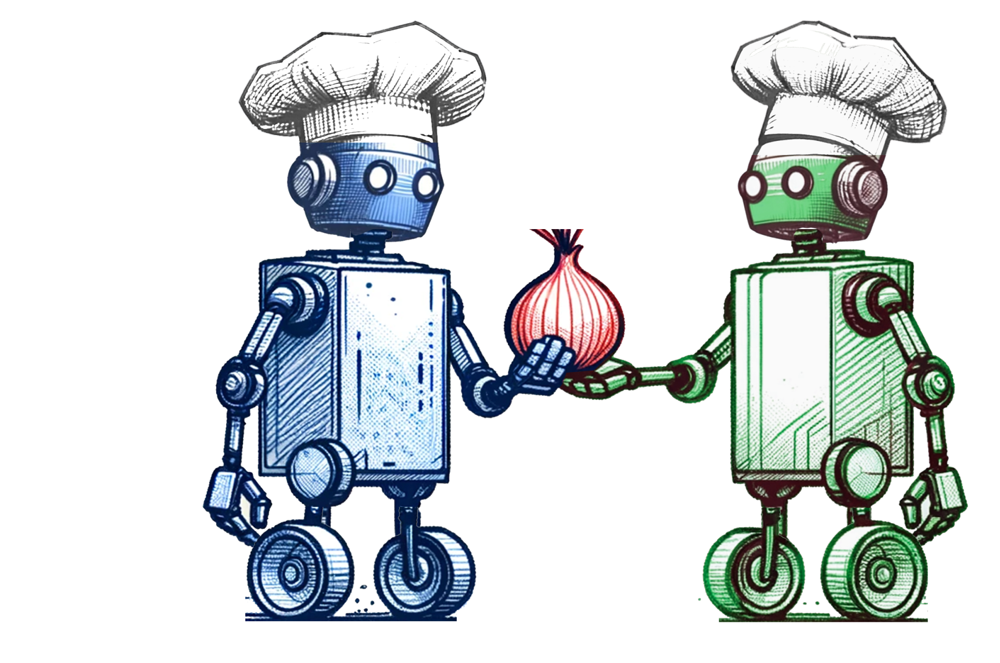

<h1>
   Reinforcement Learning for Multi-Agent LLM based Coordination
</h1>

Authors: Emil Biju, Herumb Shandilya, Nikil Ravi

While the study of LLMs (Large Language Models) has been taking off, the setting where multiple (LLM-based) agents coordinate to achieve a certain goal is not yet as well-studied. While RL techniques involving PPO and multi-layer neural networks have been successful in some settings, it is interesting to note that they have failed in other coordination-based games that use LLMs as agents. In particular, the paper notes that LLM agents outperform or match state-of-the-art RL methods in coordination games that depend more on understanding the environment, while they still struggle at effective planning. Our work investigates (a) whether trajectories from RL agents can be distilled to improve LLM performance on coordination tasks, (b) and whether LLMs can help improve the performance and generalization capabilities of RL agents on such tasks.

Dataset created for PPO-based distillation of trajectories from GPT-4o to pythia 1B: [overcooked-dataset-ppo](https://huggingface.co/datasets/emilbiju/overcooked-dataset-ppo)

Acknowledgements: For our project, we have used the following GitHub resources: [PantheonRL](https://github.com/Stanford-ILIAD/PantheonRL), [llm\_coordination](https://github.com/eric-ai-lab/llm_coordination), and [PPO training sample script](https://github.com/huggingface/trl/blob/main/examples/scripts/ppo/ppo_tldr.py).

